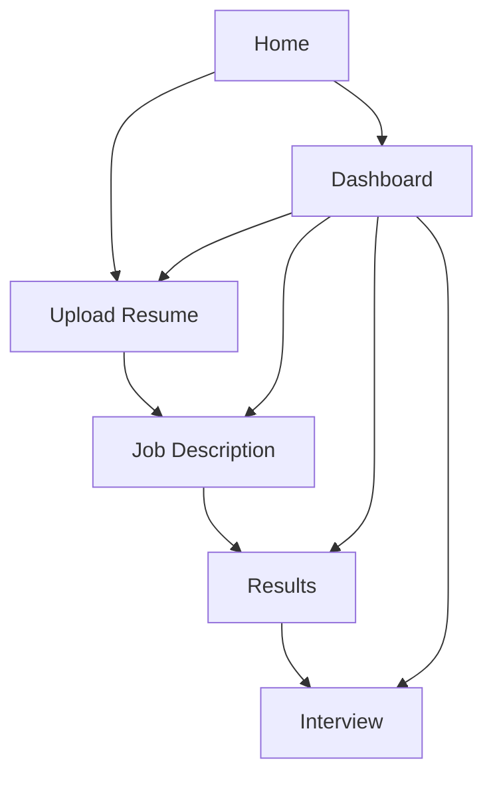

# ARCC UI/UX Design: Navigation and Screens

## 1. Navigation Map

## 2. Screen Inventory (Required Pages)
- Home (`/`)
- Dashboard (`/dashboard`)
- Upload Resume (`/upload`)
- Job Description (`/job`)
- Results (`/results`)
- Interview (`/interview`)

## 3. Shared UX Structure
- Persistent header (branding + theme toggle).
- Persistent sidebar navigation.
- Shared page container and reusable card patterns.
- Shared CTA styles and form controls (buttons/inputs/textarea).

## 4. Key Flow
1. User lands on Home and starts workflow.
2. User uploads resume and gets validation/status feedback.
3. User enters job title and job description.
4. User reviews analysis results.
5. User practices interview workflow (with planned STT-assisted flow).

## 5. Wireframe Notes (Implementation-aligned)
- Home: hero card, quick action buttons, workflow stat cards.
- Upload: file chooser, progress bar, success/error status, continue-to-job action.
- Job Description: labeled fields, inline validation, submit confirmation.
- Results/Interview: cards for insights and practice steps.
